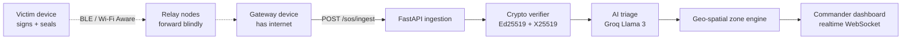

<div align="center">

# ⚡ RISHABH LABS

### `AI • ML • Robotics • Systems • Research`

> **Build. Break. Understand. Repeat.**

<a href="https://www.linkedin.com/in/rishabh-rana37"></a>
<a href="https://github.com/RishabhRana37?tab=repositories"></a>


</div>

---

I'm **Rishabh Rana**, a Computer Science & Engineering undergrad at **Manipal University Jaipur**, exploring the intersection of **Artificial Intelligence, Machine Learning, Robotics, and intelligent systems**. Currently a **Robotics Engineer intern @ VimaanX**, working with ROS.

I like turning interesting problems into working prototypes — especially the ones that sit somewhere between **software, intelligence, and the real world.** A cyclone with no cell tower. An analyst who won't trust a black box. An on-call engineer at 3am under 2,000 alerts.

---

## 🧪 ACTIVE MISSIONS

| Project | Domain | Status |
|---|---|---|
| 🧠 **Stock Domino** | ML / Financial Intelligence | 🟢 Building |
| 🌪️ **Chakravyooh — Cyclone Prediction + SOS** | AI / Disaster Management | 🟢 Building |
| ⚡ **StormLens** | AIOps / Alert Intelligence | 🔵 Shipped |
| 🩸 **GoldenHour** | Emergency Health Systems | 🔵 Shipped |
| 🤖 **Autonomous Robotics @ VimaanX** | Robotics / ROS | 🟢 Exploring |
| 🚀 **Hackathon Builds** | AI / Full Stack | 🟢 Active |

---

## 🔬 THE LAB

### 🧠 AI / ML LAB
```text
Machine Learning          scikit-learn · CatBoost · LightGBM · XGBoost
Deep Learning             PyTorch · TensorFlow
Computer Vision           satellite IR imagery · classification
Time-Series Forecasting   ERA5 · IBTrACS · trajectory + intensity
Anomaly Detection         AML graph analytics · alert correlation
Explainability            SHAP · feature attribution
```

### 🤖 ROBOTICS LAB
```text
ESP32                     TB6612FNG motor driver · 16-array IR bar
Sensors & Actuators       custom 3D-printed chassis
Motor Control             hand-tuned control loops
PID Control               built from scratch, not from a library
ROS                       autonomous systems @ VimaanX
```

### ⚙️ ENGINEERING LAB
```text
Backend                   FastAPI · Node.js · async SQLAlchemy
Frontend                  React · Vite · Tailwind · PWA
Databases                 PostgreSQL · PostGIS · Supabase · MongoDB
System Design             three-layer architectures · store abstraction
Security                  Ed25519 · X25519 · ChaCha20-Poly1305 · JWT
Infra                     Docker · Vercel · Render · GitHub Actions
```

---

## 🚀 SELECTED BUILDS

<sub>▸ every build expands — architecture, what it actually does, honest scope.</sub>

<details>
<summary><b>🧠 Stock Domino</b> — detecting shock-wave propagation across financial markets</summary>

<br>

A system that explores how a sudden movement in one stock can potentially influence related stocks — turning the market into a **network of cascading events** rather than a set of independent tickers.

`Python` `Machine Learning` `Data Analysis` `Time Series`

</details>

<details>
<summary><b>🌪️ Chakravyooh</b> — cyclone prediction + offline SOS, detection through survival</summary>

<br>

An intelligent disaster-management system combining **cyclone prediction, forecasting, and emergency response** into one pipeline:

```
DETECT ──▶ UNDERSTAND ──▶ PREDICT ──▶ ASSESS RISK ──▶ WARN ──▶ DELIVER ──▶ SURVIVE NET FAILURE
```

| Layer | What it does |
|---|---|
| **ML intelligence engine** | Multi-modal FusionNet over satellite IR / ERA5 / IBTrACS · tier-gated fail-safe engine · trajectory + intensity prediction |
| **Cloud backend** | Geospatial risk engine → zone state machine → Ed25519-signed alert generator · SOS ingestion with X25519 decryption + LLM triage |
| **Pukaar Android client** | Canvas cyclone splash · 200dp sweeping radar · satellite-dark cyclone map with forecast polylines and uncertainty cones · multi-hop SOS with ECDSA signing · live mesh peer graph |
| **Demo mode** | One-touch simulated Arabian Sea cyclone `CY-2026-001` with live risk zones and incoming flood distress |

`PyTorch` `FastAPI` `Kotlin/Android` `Groq` `Forecasting`

🔗 [RealArnav007/CHAKRAVYOOH](https://github.com/RealArnav007/CHAKRAVYOOH)

</details>

<details>
<summary><b>🚨 Pukar</b> — SOS packets hop phone-to-phone when every tower is down</summary>

<br>

**Phone = communicate. Backend = understand. Web = act.** A victim's SOS hops over Wi-Fi Aware / BLE across ordinary Android phones until it reaches one with connectivity, which forwards it to a cloud command center.



- **Zero-trust by construction** — 15 immutable fields serialized to canonical bytes and Ed25519-signed; any relay tampering returns `401 BAD_SIGNATURE`. Payloads are X25519-sealed (ChaCha20-Poly1305), so relays carry what they cannot read.
- **Correlation engine** — Haversine clustering folds reports within 500 m / 2 h into one incident; zones escalate `NORMAL → EMERGING → HIGH → CRITICAL → EXTREME`.
- **Replay-proof** — ±5 min clock-drift window + DB-backed unique `msg_id`.
- **Tested** — 18-suite `pytest` integration layer, containerized for Render.

`FastAPI` `Ed25519/X25519` `PostgreSQL` `Next.js`

<sub>Private repository — walkthrough available on request.</sub>

</details>

<details>
<summary><b>⚡ StormLens</b> — 2,000 alerts in, 3 answers out</summary>

<br>

Alert correlation & deduplication engine — Team ZenVerse @ **Synergy 2026**, HPE Problem Statement #10. During a major incident, monitoring floods on-call engineers with thousands of alerts that are nearly all downstream symptoms of one root cause.

StormLens ingests the raw stream and in real time **correlates** temporally + semantically related alerts, **ranks the likely root cause** with a confidence score from topology/timing/severity, **suppresses** derivative noise, and **summarizes** each incident into a one-paragraph brief with a recommended first action.

```text
BENCHMARK  aiops-scn1 (labeled ground truth)
  Root-cause Hit@1 ████████████████████░  92.3%
  Root-cause Hit@3 █████████████████████  100%
  Cluster purity   █████████████████████  100%
```

<sub>Reproducible via `backend/eval/harness.py` — numbers, not vibes.</sub>

`FastAPI` `Embeddings` `React` `LLM`

🔗 [ZenVerse-synergy-2026](https://github.com/RishabhRana37/ZenVerse-synergy-2026)

</details>

<details>
<summary><b>🩸 GoldenHour</b> — one GPS tap → the right hospital and ready blood, in parallel</summary>

<br>

A PWA + feature-phone SMS service for the **self-transporting emergency family in India** — the majority of patients, who travel by private car or auto, entirely outside any ambulance system. One `POST /emergency` fans out into two simultaneous actions:

1. **Hospital** — rank by department + proximity, send one-tap confirmation links; the first hospital to tap **Accept** takes the patient. A human confirming a bed, never a stale number.
2. **Blood** — match compatible nearby replacement donors and route them to the nearest licensed blood bank.

Three-layer backend with `InMemoryStore` / `SupabaseStore` behind one `get_store()`: the demo runs with **zero external services**, production is a true drop-in. 31 tests passing, CI on every PR, `API_CONTRACT.md` as the single source of truth for both sides.

`FastAPI` `Supabase/PostGIS` `React 19` `PWA`

🔗 [SarmaHighOnCode/GoldenHour](https://github.com/SarmaHighOnCode/GoldenHour) · Bharat Academix CodeQuest 2026

</details>

<details>
<summary><b>💸 Money-Trail-Engine (AURA)</b> — an AML engine that explains every flag</summary>

<br>

Fuses a Random Forest classifier with NetworkX graph analytics to surface money-laundering rings — then explains *why* each transaction was flagged, so an analyst can act on it instead of trusting a black box.

`FastAPI` `scikit-learn` `NetworkX` `React`

🔗 [Money-Trail-Engine](https://github.com/RishabhRana37/Money-Trail-Engine)

</details>

<details>
<summary><b>⚽ Offside</b> — per-match goal probability, OOF AP 0.45</summary>

<br>

CatBoost/LightGBM ensemble predicting per-match goal-scoring probability, validated out-of-fold (**AP 0.45**) with SHAP for feature attribution. Built for the IEEE CS MUJ datathon and shipped as a Streamlit app.

`CatBoost` `LightGBM` `SHAP` `Streamlit`

🔗 [offside-football-prediction](https://github.com/RishabhRana37/offside-football-prediction)

</details>

<details>
<summary><b>🛣️ RoadGuard AI</b> — offline-first road-safety PWA</summary>

<br>

Hazard analytics, driving rules for 120+ countries, India/USA fine calculators and emergency SOS — all working with no connection. Built for the National Road Safety Hackathon @ IIT Madras.

`FastAPI` `React` `TypeScript` `PWA`

🔗 [roadguard-ai](https://github.com/RishabhRana37/roadguard-ai)

</details>

<details>
<summary><b>🤖 Robotics Experiments</b> — line-following, PID tuning, autonomous behaviour</summary>

<br>

A collection of experiments involving **line-following robots, sensors, motor control, PID tuning, ESP32 systems, and autonomous behaviour** — including a from-scratch PID line-follower on ESP32 + TB6612FNG with a 16-array IR sensor bar and a custom 3D-printed chassis. The control loop was written and tuned by hand: the fastest way to learn that theory and a real motor disagree.

`ESP32` `C/C++` `Embedded Systems` `ROS`

</details>

---

## 🏆 HACKATHON MODE

```text
PROBLEM
   ↓
RESEARCH
   ↓
PROTOTYPE
   ↓
BUILD
   ↓
BREAK
   ↓
ITERATE
   ↓
DEMO
```

I enjoy hackathons because they force ideas to become **working systems under constraints** — IEEE CS MUJ datathon, National Road Safety Hackathon @ IIT Madras, Synergy 2026 (HPE), Bharat Academix CodeQuest 2026.

---

## 🔭 CURRENTLY EXPLORING

```text
→ Deep Learning
→ Computer Vision
→ Time-Series ML
→ LLMs & AI Agents
→ Autonomous Systems & ROS
→ Docker / Kubernetes
→ AI Research
→ Open Source
```

---

## 🧬 MY ENGINEERING PHILOSOPHY

> Don't just learn the technology.  
> **Build something with it.**

I learn best by going from:

**Idea → Research → Implementation → Failure → Iteration → Working Prototype**

A model that never leaves the notebook did not happen. If it can't run end-to-end, it isn't done yet.

---

## 📊 GITHUB ACTIVITY

<p align="center">
  
  
</p>

<p align="center">
  
</p>

---

## 🧰 TECHNOLOGY STACK

<p align="center">


</p>

---

## 🌐 CONNECT

<p align="center">

<a href="https://github.com/RishabhRana37">

</a>

<a href="https://www.linkedin.com/in/rishabh-rana37">

</a>

</p>

---

## 🛰️ NEXT MISSION

```text
[██████████████████░░] 90%

Build better systems.
Research deeper.
Ship more.
```

<div align="center">

### `RISHABH LABS // ONLINE`

**Thanks for visiting the lab. ⚡**

</div>
