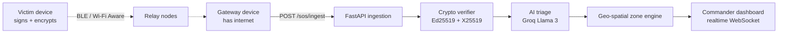

<div align="center">

<a href="https://www.linkedin.com/in/rishabh-rana37">
  
</a>

<p>
  <a href="https://www.linkedin.com/in/rishabh-rana37"></a>
  <a href="https://github.com/RishabhRana37?tab=repositories"></a>
  
  
</p>

</div>

---

**CS undergrad @ Manipal University Jaipur** · I build full-stack + ML products for real problems.

I like taking a model from a notebook all the way to something people can actually click — real hardware, real frontends, real deployments. Currently a **Robotics Engineer intern @ VimaanX** working with ROS.

```text
Working on  ›  applied ML + edge-AI that ships to production
Learning    ›  Docker / Kubernetes · the ML engineering track
Method      ›  I learn by building — most of this started as a hackathon
               or a "can I actually make this work" question
```

<div align="center">

<a href="https://github.com/RishabhRana37">
  
</a>
<a href="https://github.com/RishabhRana37">
  
</a>

</div>

---

## 🛰 Featured work

<sub>Click a project to expand — architecture, what it actually does, and the honest scope.</sub>

<details>
<summary><b>🌀 Chakravyooh / Pukaar</b> — physics-informed AI disaster intelligence + offline emergency mesh &nbsp;·&nbsp; <code>PyTorch</code> <code>FastAPI</code> <code>Android</code> <code>Groq</code></summary>

<br>

Re-engineers disaster response from reactive to predictive across the whole lifecycle:
**Detect → Understand → Predict → Assess Risk → Warn → Deliver → Survive Network Failure.**

| Piece | What it does |
|---|---|
| **ML intelligence engine** | Multi-modal FusionNet over satellite IR / ERA5 / IBTrACS, a tier-gate fail-safe engine, and trajectory + intensity prediction |
| **Cloud backend** | Geospatial risk engine → zone state machine → Ed25519-signed alert generator, plus SOS ingestion with X25519 decryption and LLM triage |
| **Pukaar Android client** | Canvas cyclone splash, 200dp sweeping radar widget, satellite-dark cyclone map with forecast polylines and uncertainty cones, multi-hop SOS with ECDSA signing, live mesh peer graph |
| **Demo mode** | One-touch simulated Arabian Sea cyclone (`CY-2026-001`) with risk zones and incoming flood distress |

🔗 [RealArnav007/CHAKRAVYOOH](https://github.com/RealArnav007/CHAKRAVYOOH)

</details>

<details>
<summary><b>🚨 Pukar</b> — offline-first emergency mesh: SOS packets hop phone-to-phone with no network &nbsp;·&nbsp; <code>FastAPI</code> <code>Ed25519/X25519</code> <code>PostgreSQL</code> <code>Next.js</code></summary>

<br>

When disasters knock out cell towers, ordinary Android phones form a self-healing mesh: a victim's SOS hops over Wi-Fi Aware / BLE until it reaches a phone that still has connectivity, which forwards it to a cloud command center. **Phone = communicate. Backend = understand. Web = act.**



- **Zero-trust by construction** — 15 immutable fields serialized to canonical bytes and Ed25519-signed; any relay tampering returns `401 BAD_SIGNATURE`. Payloads are X25519 sealed (ChaCha20-Poly1305), so relays forward blindly.
- **Correlation engine** — Haversine clustering folds reports within 500 m / 2 h into unified incidents; zones escalate `NORMAL → EMERGING → HIGH → CRITICAL → EXTREME`.
- **Replay-proof** — ±5 min clock-drift window plus a DB-backed unique `msg_id`.
- **Tested** — 18-suite `pytest` integration layer; containerized for Render.

<sub>Private repository — walkthrough available on request.</sub>

</details>

<details>
<summary><b>⚡ StormLens</b> — from 2,000 alerts to 3 answers &nbsp;·&nbsp; <code>FastAPI</code> <code>embeddings</code> <code>React</code> <code>LLM</code></summary>

<br>

Alert correlation & deduplication engine — Team ZenVerse @ **Synergy 2026**, HPE Problem Statement #10. During a major incident, monitoring floods on-call engineers with thousands of alerts that are almost all downstream symptoms of one root cause.

StormLens ingests the raw stream and, in real time: **correlates** temporally and semantically related alerts into clusters, **ranks the likely root cause** with a confidence score using topology/timing/severity, **suppresses** derivative noise, and **summarizes** each incident into a one-paragraph brief with a recommended first action.

| Measured on labeled ground truth (`aiops-scn1`) | Result |
|---|---|
| Root-cause Hit@1 | **92.3%** |
| Root-cause Hit@3 | **100%** |
| Cluster purity | **100%** |

<sub>Reproducible via `backend/eval/harness.py` — numbers, not vibes.</sub>

🔗 [ZenVerse-synergy-2026](https://github.com/RishabhRana37/ZenVerse-synergy-2026)

</details>

<details>
<summary><b>🩸 GoldenHour</b> — one GPS tap → the right hospital and ready blood, in parallel &nbsp;·&nbsp; <code>FastAPI</code> <code>Supabase/PostGIS</code> <code>React 19</code> <code>PWA</code></summary>

<br>

A PWA + feature-phone SMS service for the **self-transporting emergency family in India** — the majority of patients, who travel by private car or auto, entirely outside any ambulance system. One `POST /emergency` fans out into two simultaneous actions:

1. **Hospital** — rank by department + proximity, send one-tap confirmation links; the first hospital to tap **Accept** takes the patient. A human confirming a bed, never a stale or guessed number.
2. **Blood** — match compatible nearby replacement donors and route them to the nearest licensed blood bank.

Three-layer backend with `InMemoryStore` / `SupabaseStore` behind one `get_store()`: the demo runs with **zero external services**, and production is a true drop-in. 31 tests passing, CI on every PR, `API_CONTRACT.md` as the single source of truth for both sides.

🔗 [SarmaHighOnCode/GoldenHour](https://github.com/SarmaHighOnCode/GoldenHour) · Bharat Academix CodeQuest 2026

</details>

<details>
<summary><b>💸 Money-Trail-Engine (AURA)</b> — AML engine that explains every flag &nbsp;·&nbsp; <code>FastAPI</code> <code>scikit-learn</code> <code>NetworkX</code> <code>React</code></summary>

<br>

Fuses a Random Forest classifier with NetworkX graph analytics to surface money-laundering rings — then explains why each transaction was flagged, so an analyst can act on it instead of trusting a black box.

🔗 [Money-Trail-Engine](https://github.com/RishabhRana37/Money-Trail-Engine)

</details>

<details>
<summary><b>⚽ Offside</b> — per-match goal probability, OOF AP 0.45 &nbsp;·&nbsp; <code>CatBoost</code> <code>LightGBM</code> <code>SHAP</code> <code>Streamlit</code></summary>

<br>

CatBoost/LightGBM ensemble predicting per-match goal-scoring probability, validated out-of-fold (**AP 0.45**) with SHAP for feature attribution. Built for the IEEE CS MUJ datathon and shipped as a Streamlit app.

🔗 [offside-football-prediction](https://github.com/RishabhRana37/offside-football-prediction)

</details>

<details>
<summary><b>🛣 RoadGuard AI</b> — offline-first road-safety PWA &nbsp;·&nbsp; <code>FastAPI</code> <code>React</code> <code>TypeScript</code> <code>PWA</code></summary>

<br>

Hazard analytics, driving rules for 120+ countries, India/USA fine calculators, and emergency SOS — all working offline. Built for the National Road Safety Hackathon @ IIT Madras.

🔗 [roadguard-ai](https://github.com/RishabhRana37/roadguard-ai)

</details>

<details>
<summary><b>🌿 Harvest-Guard (CropDoc AI)</b> — leaf photo in, diagnosis out &nbsp;·&nbsp; <code>React</code> <code>TensorFlow</code> <code>Node.js</code> <code>MongoDB</code></summary>

<br>

Upload a leaf image and get an instant crop-disease diagnosis with treatment recommendations — built for farmers on low-end phones.

🔗 [Harvest-Guard](https://github.com/RishabhRana37/Harvest-Guard)

</details>

<details>
<summary><b>🎯 Habitfy</b> — premium, privacy-first, gamified habit tracking &nbsp;·&nbsp; <code>Vanilla JS</code> <code>Chart.js</code> <code>localStorage</code></summary>

<br>

A glassmorphic habit dashboard with XP/levels, streak statistics, pie + weekly-consistency charts, a leaderboard and a rewards store — all client-side, with data export and no account required.

🔗 [Habitfy](https://github.com/RishabhRana37/Habitfy)

</details>

<details>
<summary><b>🤖 PID line-follower</b> — built from scratch, tuned by hand &nbsp;·&nbsp; <code>ESP32</code> <code>TB6612FNG</code> <code>16-array IR</code></summary>

<br>

A from-scratch PID line-follower: ESP32, TB6612FNG motor driver, a 16-array IR sensor bar, and a custom 3D-printed chassis. Control loop written and tuned by hand — the fastest way to learn that theory and a real motor disagree.

</details>

---

## 🧰 Tech I work with

<div align="center">


</div>

| Layer | Tools |
|---|---|
| **Languages** | Python · TypeScript · JavaScript · C++ |
| **ML / Data** | scikit-learn · CatBoost · LightGBM · XGBoost · TensorFlow · SHAP · NetworkX |
| **Backend** | FastAPI · Node.js · SQLAlchemy (async) |
| **Frontend** | React · Vite · Tailwind · PWA |
| **Data stores** | PostgreSQL · PostGIS · Supabase · MongoDB · SQLite |
| **Infra / Deploy** | Docker · Vercel · Render · Streamlit · GitHub Actions |
| **Embedded / Robotics** | ESP32 · ROS · PID control |
| **Security** | Ed25519 · X25519 · ChaCha20-Poly1305 · JWT · RBAC |

---

## 📈 Contribution rhythm

<div align="center">


</div>

---

## 📫 Reach me

<div align="center">

<a href="https://www.linkedin.com/in/rishabh-rana37"></a>
<a href="https://github.com/RishabhRana37"></a>

<br><br>

<b>Builder-first. If it can't run end-to-end, it isn't done yet.</b>

<sub>Open to ML / full-stack / robotics roles · Jaipur, Rajasthan 🇮🇳</sub>

</div>
