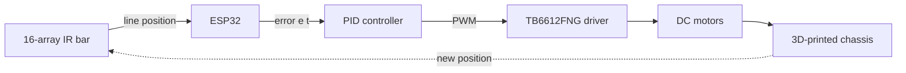
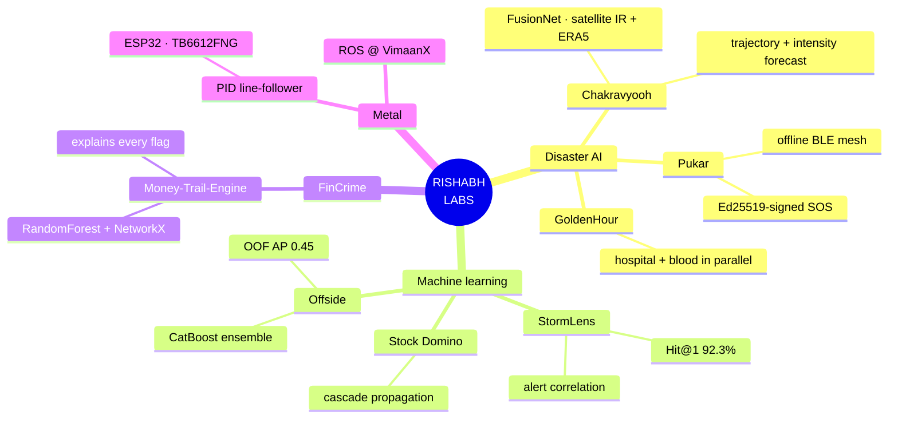
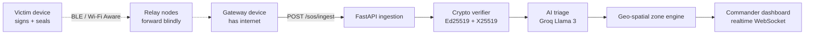

<div align="center">

<a href="https://www.linkedin.com/in/rishabh-rana37">

</a>

<br>

<a href="mailto:rishabhrana3726@gmail.com"></a>
<a href="https://www.linkedin.com/in/rishabh-rana37"></a>
<a href="https://github.com/RishabhRana37?tab=repositories"></a>


</div>

```
╔══════════════════════════════════════════════════════════════════════════════╗
║  RISHABH LABS · INSTRUMENT PANEL                              ▊ ONLINE       ║
╠══════════════════════════════════════════════════════════════════════════════╣
║  PI        Rishabh Rana — CSE undergrad, Manipal University Jaipur           ║
║  RESIDENCY Robotics Engineer intern @ VimaanX — ROS                          ║
║  WINGS     AI/ML  ·  ROBOTICS  ·  SYSTEMS                                    ║
║  DOMAINS   disaster-tech · fincrime · AIOps · financial ML · embedded        ║
║  DOCTRINE  idea → research → implementation → failure → iteration → prototype║
╚══════════════════════════════════════════════════════════════════════════════╝
```

I turn interesting problems into working prototypes — especially the ones sitting between **software, intelligence, and the real world.** A cyclone with no cell tower. An analyst who won't trust a black box. An on-call engineer at 3am under 2,000 alerts.


---

## `01 ·` EXPERIMENT LEDGER

| ID | Experiment | Wing | Phase | Readout |
|---|---|---|---|---|
| `EXP-08` | 🧠 **Stock Domino** | Financial ML | 🟢 `IN PROGRESS` | shock-wave propagation across tickers |
| `EXP-07` | 🌪️ **Chakravyooh** | Disaster AI | 🟢 `IN PROGRESS` | detect → predict → warn → survive |
| `EXP-06` | ⚡ **StormLens** | AIOps | 🔵 `PUBLISHED` | Hit@1 **92.3%** on `aiops-scn1` |
| `EXP-05` | 🩸 **GoldenHour** | Emergency systems | 🔵 `PUBLISHED` | 31 tests · CI on every PR |
| `EXP-04` | 🚨 **Pukar** | Mesh networking | 🔵 `PUBLISHED` | zero-trust offline SOS relay |
| `EXP-03` | 💸 **Money-Trail-Engine** | FinCrime | 🔵 `PUBLISHED` | every flag comes with a reason |
| `EXP-02` | ⚽ **Offside** | Sports ML | 🔵 `PUBLISHED` | OOF **AP 0.45** |
| `EXP-01` | 🤖 **Robotics bench** | Embedded | 🟣 `ONGOING` | PID tuned by hand, not by library |


## `02 ·` LAB WINGS

<div align="center">

<a href="#-aiml-wing"></a>
<a href="#-robotics-wing"></a>
<a href="#-systems-wing"></a>

<sub>▸ three wings, one bench. expand any of them.</sub>

</div>

<details open>
<summary><b>🧠 AI / ML WING</b> &nbsp;<code>bench 01</code> — models that have to survive a real input</summary>

<br>

<div align="center">

</div>

```text
CAPABILITY                    DEPTH                      SHIPPED IN
  Gradient boosting           ██████████████████░░  90%  Offside · StormLens
  Deep learning (PyTorch)     ███████████████░░░░░  75%  Chakravyooh
  Time-series forecasting     ██████████████░░░░░░  70%  Chakravyooh · Stock Domino
  Computer vision             █████████████░░░░░░░  65%  satellite IR classification
  Anomaly / graph analytics   ███████████████░░░░░  75%  Money-Trail-Engine
  Explainability (SHAP)       ████████████████░░░░  80%  Offside · AURA
```

| Instrument | Use |
|---|---|
| `CatBoost` `LightGBM` `XGBoost` | tabular ensembles, out-of-fold validated |
| `PyTorch` `TensorFlow` | FusionNet multi-modal architectures |
| `ERA5` `IBTrACS` | reanalysis + best-track cyclone data |
| `SHAP` `NetworkX` | attribution and relationship structure |

</details>

<details>
<summary><b>🤖 ROBOTICS WING</b> &nbsp;<code>bench 02</code> — where theory and a real motor disagree</summary>

<br>

<div align="center">

</div>



```text
CAPABILITY                    DEPTH                      NOTES
  Microcontrollers (ESP32)    ████████████████░░░░  80%  bare-metal, no framework crutches
  Motor control / drivers     ███████████████░░░░░  75%  TB6612FNG H-bridge
  PID tuning                  ██████████████░░░░░░  70%  written by hand, tuned by hand
  Sensor arrays               ███████████████░░░░░  75%  16-channel IR calibration
  ROS                         ███████████░░░░░░░░░  55%  live — VimaanX residency
  Fabrication                 ████████████░░░░░░░░  60%  custom 3D-printed chassis
```

</details>

<details>
<summary><b>⚙️ SYSTEMS WING</b> &nbsp;<code>bench 03</code> — the part that has to still be up at 3am</summary>

<br>

<div align="center">

</div>

```text
LAYER        STACK                                          STATE
  backend    FastAPI · Node.js · async SQLAlchemy           ● active
  frontend   React · Vite · Tailwind · PWA                  ● active
  data       PostgreSQL · PostGIS · Supabase · MongoDB      ● active
  security   Ed25519 · X25519 · ChaCha20-Poly1305 · JWT     ● active
  infra      Docker · Vercel · Render · GitHub Actions      ● active
  orchestr.  Kubernetes                                     ○ loading…
```

<sub>The security row isn't decoration — Pukar signs 15 immutable fields per SOS packet and seals the payload so relays forward what they cannot read.</sub>

</details>


## `03 ·` RESEARCH MAP

> One obsession — systems that hold up when conditions are hostile — across four domains.




## `04 ·` EXPERIMENT NOTEBOOKS

<sub>▸ open a notebook — hypothesis, architecture, and the honest scope.</sub>

<details>
<summary><b><code>EXP-08</code> &nbsp;🧠 STOCK DOMINO</b> — shock-wave propagation across financial markets</summary>

<br>

> **Hypothesis** — a market is not a set of independent tickers; it's a network, and a shock propagates along its edges.

A system exploring how a sudden movement in one stock can influence related stocks — turning the market into a **network of cascading events** instead of isolated price series.

`Python` `Machine Learning` `Data Analysis` `Time Series`

`STATUS: 🟢 in progress`

</details>

<details>
<summary><b><code>EXP-07</code> &nbsp;🌪️ CHAKRAVYOOH</b> — cyclone prediction + offline SOS, detection through survival</summary>

<br>

> **Hypothesis** — disaster response fails at the seam between prediction and delivery. Build across the seam.

```
DETECT ──▶ UNDERSTAND ──▶ PREDICT ──▶ ASSESS RISK ──▶ WARN ──▶ DELIVER ──▶ SURVIVE NET FAILURE
```

| Layer | What it does |
|---|---|
| **ML intelligence engine** | Multi-modal FusionNet over satellite IR / ERA5 / IBTrACS · tier-gated fail-safe engine · trajectory + intensity prediction |
| **Cloud backend** | Geospatial risk engine → zone state machine → Ed25519-signed alert generator · SOS ingestion with X25519 decryption + LLM triage |
| **Pukaar Android client** | Canvas cyclone splash · 200dp sweeping radar · satellite-dark cyclone map with forecast polylines and uncertainty cones · multi-hop SOS with ECDSA signing · live mesh peer graph |
| **Demo mode** | One-touch simulated Arabian Sea cyclone `CY-2026-001` with live risk zones and incoming flood distress |

`PyTorch` `FastAPI` `Kotlin/Android` `Groq`

🔗 [RealArnav007/CHAKRAVYOOH](https://github.com/RealArnav007/CHAKRAVYOOH)

</details>

<details>
<summary><b><code>EXP-06</code> &nbsp;⚡ STORMLENS</b> — 2,000 alerts in, 3 answers out</summary>

<br>

> **Hypothesis** — during an incident, almost every alert is a symptom. Find the one that isn't.

Alert correlation & deduplication engine — Team ZenVerse @ **Synergy 2026**, HPE Problem Statement #10. It ingests the raw stream and in real time **correlates** temporally + semantically related alerts, **ranks the likely root cause** with a confidence score from topology/timing/severity, **suppresses** derivative noise, and **summarizes** each incident into a one-paragraph brief with a recommended first action.

```text
READOUT · benchmark aiops-scn1 (labeled ground truth)
  Root-cause Hit@1  ████████████████████░   92.3%
  Root-cause Hit@3  █████████████████████   100%
  Cluster purity    █████████████████████   100%
```

<sub>Reproducible via `backend/eval/harness.py` — numbers, not vibes.</sub>

`FastAPI` `Embeddings` `React` `LLM`

🔗 [ZenVerse-synergy-2026](https://github.com/RishabhRana37/ZenVerse-synergy-2026)

</details>

<details>
<summary><b><code>EXP-05</code> &nbsp;🩸 GOLDENHOUR</b> — one GPS tap → the right hospital and ready blood, in parallel</summary>

<br>

> **Hypothesis** — most Indian emergency patients never touch an ambulance. Design for the family already in the car.

A PWA + feature-phone SMS service for the **self-transporting emergency family**. One `POST /emergency` fans out into two simultaneous actions:

1. **Hospital** — rank by department + proximity, send one-tap confirmation links; the first hospital to tap **Accept** takes the patient. A human confirming a bed, never a stale number.
2. **Blood** — match compatible nearby replacement donors and route them to the nearest licensed blood bank.

Three-layer backend with `InMemoryStore` / `SupabaseStore` behind one `get_store()`: the demo runs with **zero external services**, production is a true drop-in. 31 tests passing, CI on every PR, `API_CONTRACT.md` as the single source of truth for both sides.

`FastAPI` `Supabase/PostGIS` `React 19` `PWA`

🔗 [SarmaHighOnCode/GoldenHour](https://github.com/SarmaHighOnCode/GoldenHour) · Bharat Academix CodeQuest 2026

</details>

<details>
<summary><b><code>EXP-04</code> &nbsp;🚨 PUKAR</b> — SOS packets hop phone-to-phone when every tower is down</summary>

<br>

> **Hypothesis** — the network is the first casualty. Assume it's gone and design the protocol anyway.

**Phone = communicate. Backend = understand. Web = act.**



- **Zero-trust by construction** — 15 immutable fields serialized to canonical bytes and Ed25519-signed; any relay tampering returns `401 BAD_SIGNATURE`. Payloads are X25519-sealed (ChaCha20-Poly1305), so relays carry what they cannot read.
- **Correlation engine** — Haversine clustering folds reports within 500 m / 2 h into one incident; zones escalate `NORMAL → EMERGING → HIGH → CRITICAL → EXTREME`.
- **Replay-proof** — ±5 min clock-drift window + DB-backed unique `msg_id`.
- **Tested** — 18-suite `pytest` integration layer, containerized for Render.

`FastAPI` `Ed25519/X25519` `PostgreSQL` `Next.js`

<sub>Private repository — walkthrough available on request.</sub>

</details>

<details>
<summary><b><code>EXP-03</code> &nbsp;💸 MONEY-TRAIL-ENGINE (AURA)</b> — an AML engine that explains every flag</summary>

<br>

> **Hypothesis** — an unexplained fraud score is an unusable fraud score.

Fuses a Random Forest classifier with NetworkX graph analytics to surface money-laundering rings — then explains *why* each transaction was flagged, so an analyst can act on it instead of trusting a black box.

`FastAPI` `scikit-learn` `NetworkX` `React`

🔗 [Money-Trail-Engine](https://github.com/RishabhRana37/Money-Trail-Engine)

</details>

<details>
<summary><b><code>EXP-02</code> &nbsp;⚽ OFFSIDE</b> — per-match goal probability, OOF AP 0.45</summary>

<br>

CatBoost/LightGBM ensemble predicting per-match goal-scoring probability, validated out-of-fold (**AP 0.45**) with SHAP for feature attribution. Built for the IEEE CS MUJ datathon and shipped as a Streamlit app.

`CatBoost` `LightGBM` `SHAP` `Streamlit`

🔗 [offside-football-prediction](https://github.com/RishabhRana37/offside-football-prediction)

</details>

<details>
<summary><b><code>EXP-01</code> &nbsp;🤖 ROBOTICS BENCH</b> — line-following, PID tuning, autonomous behaviour</summary>

<br>

> **Finding** — theory and a real motor disagree, and the motor is right.

Line-following robots, sensor arrays, motor control, PID tuning, ESP32 systems and autonomous behaviour — including a from-scratch PID line-follower on ESP32 + TB6612FNG with a 16-array IR sensor bar and a custom 3D-printed chassis. Control loop written and tuned by hand.

Now extending into **ROS and autonomous systems** during the VimaanX residency.

`ESP32` `C/C++` `Embedded Systems` `ROS`

</details>

<details>
<summary><b><code>EXP-00</code> &nbsp;🛣️ ROADGUARD AI</b> — offline-first road-safety PWA</summary>

<br>

Hazard analytics, driving rules for 120+ countries, India/USA fine calculators and emergency SOS — all working with no connection. Built for the National Road Safety Hackathon @ IIT Madras.

`FastAPI` `React` `TypeScript` `PWA`

🔗 [roadguard-ai](https://github.com/RishabhRana37/roadguard-ai)

</details>


## `05 ·` FIELD PROTOCOL

<table>
<tr>
<td valign="top" width="42%">

```text
      PROBLEM
         │
      RESEARCH
         │
     PROTOTYPE
         │
       BUILD
         │
       BREAK  ◀──┐
         │       │
      ITERATE ───┘
         │
        DEMO
```

</td>
<td valign="top">

**Why hackathons.** They force an idea to become a **working system under constraints** — a deadline is the only reliable cure for a beautiful architecture that never runs.

```text
IEEE CS MUJ Datathon              Offside
National Road Safety @ IIT Madras RoadGuard AI
Synergy 2026 · HPE PS#10          StormLens
Bharat Academix CodeQuest 2026    GoldenHour
```

</td>
</tr>
</table>


## `06 ·` TELEMETRY

<div align="center">


<br>


</div>


## `07 ·` NEXT MISSION

```text
RESEARCH TRACKS                                              ALLOCATION
  Deep learning & computer vision    ████████████████░░░░       80%
  Autonomous systems & ROS           ██████████████░░░░░░       70%
  LLMs & AI agents                   █████████████░░░░░░░       65%
  Time-series & financial ML         ████████████░░░░░░░░       60%
  Docker / Kubernetes                ████████░░░░░░░░░░░░       40%

NEXT              [██████████████████░░]  90%
                  Build better systems. Research deeper. Ship more.
```

> Don't just learn the technology. **Build something with it.**
> A model that never leaves the notebook did not happen.

<div align="center">

<a href="mailto:rishabhrana3726@gmail.com"></a>
<a href="https://www.linkedin.com/in/rishabh-rana37"></a>
<a href="https://github.com/RishabhRana37"></a>

### `RISHABH LABS // ONLINE`

<sub>Open to ML · full-stack · robotics roles &nbsp;·&nbsp; Jaipur, Rajasthan 🇮🇳</sub>

</div>


